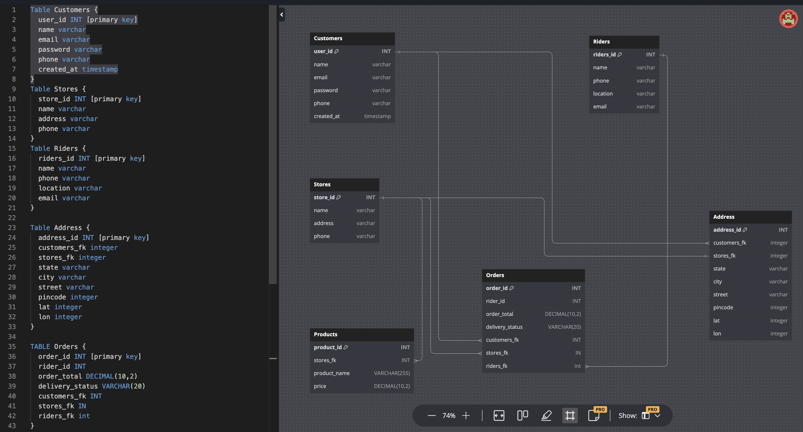

# Asset Management System for Delivery Hubs

This project is an asset management system designed specifically to manage delivery hubs, catering to businesses with multiple delivery hubs, customers, and riders. The application is built using Node.js with the Express framework for the backend, and MySQL is utilized as the database management system.

# Features

Multiple Delivery Hubs: The system supports the management of multiple delivery hubs, allowing businesses to efficiently organize their delivery operations.

Customer Management: Customers can be registered and managed within the system, enabling seamless order placement and tracking.

Rider Assignment: Riders are assigned to delivery tasks, ensuring timely and efficient order fulfillment.

Order Tracking: Customers can track the status of their orders, providing transparency and improving customer satisfaction.

# Setup Instructions

```
git clone https://github.com/akash-mule-dev/asset-field-management.git
```

```
cd asset-field-management
```

```
npm i
```

```
npm run start
```

Once the server is running, access the application through the specified port in your browser.

# Database Schema


